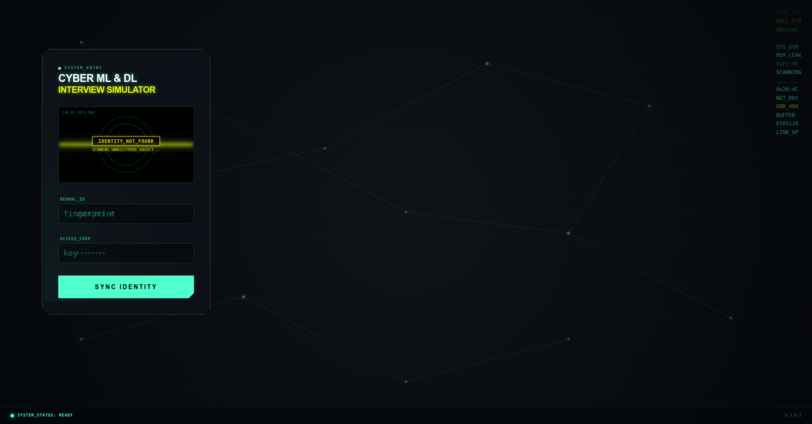
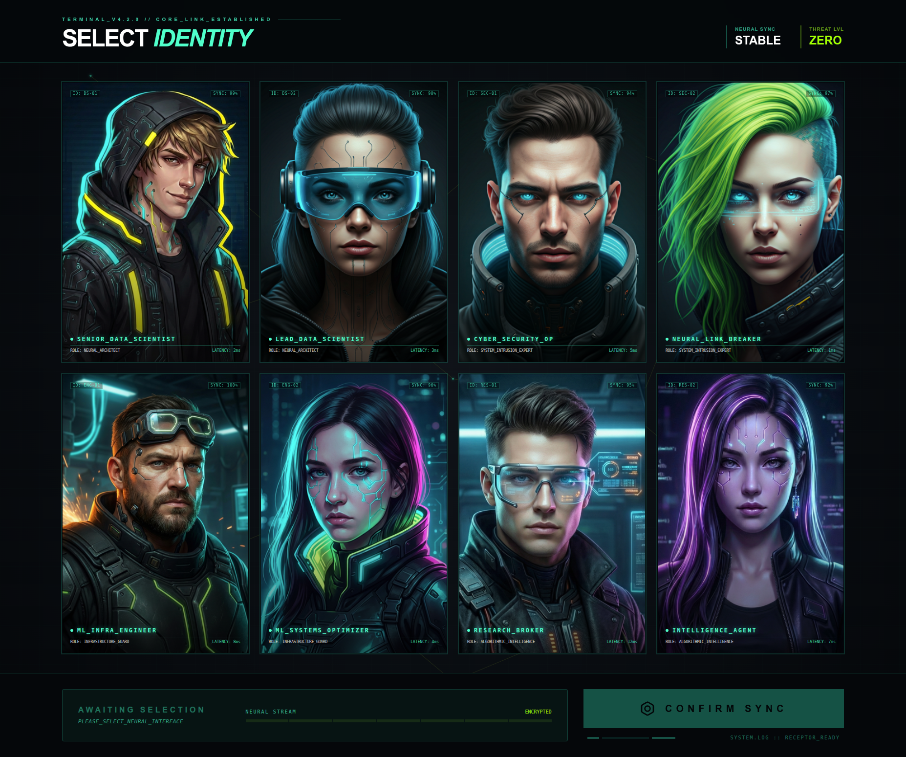
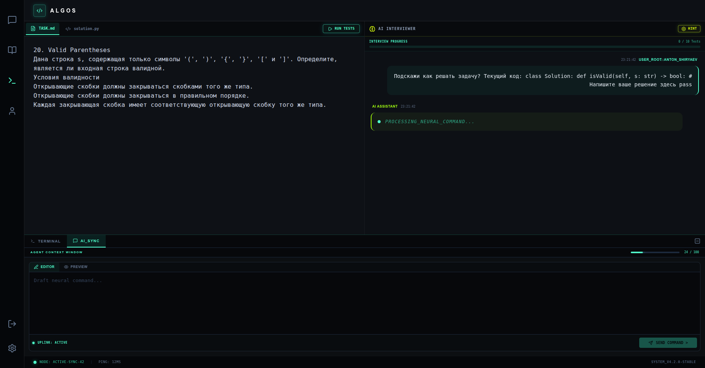
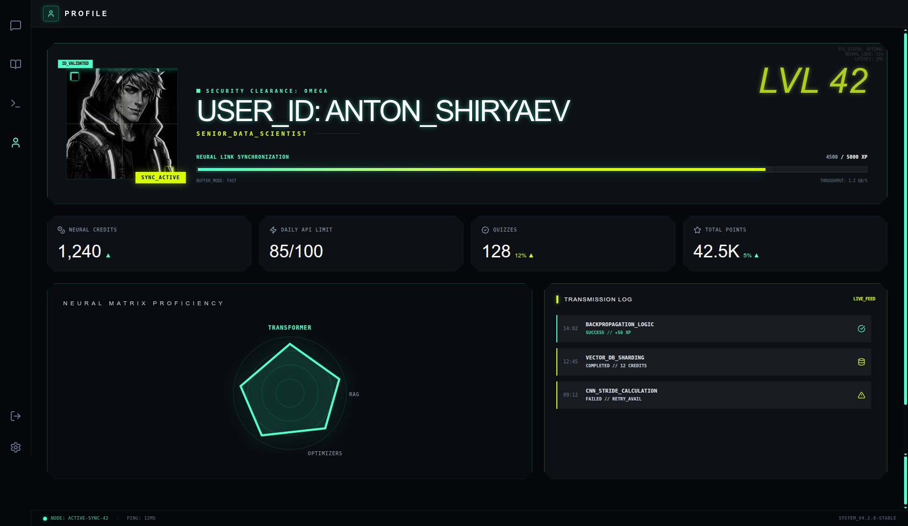

# learning-ai-assistant

Агентная система для ведения Obsidian-базы заметок по алгоритмам, генерации квизов по заметкам и проведения алгоритмических собеседований.

## Для кого и какая боль

**Целевая аудитория**: разработчики, готовящиеся к алгоритмическим интервью и поддерживающие личную базу знаний в Obsidian.

**Проблема**:
- заметки по алгоритмам быстро разрастаются, теряются темы и связи;
- сложно регулярно проверять понимание тем и поддерживать дисциплину повторения;
- подготовка к интервью требует тренировки задач и объективной обратной связи, а прогресс часто не фиксируется удобно и структурированно.

## Что делает PoC на демо

1) **Tagging заметки**
- пользователь просит подобрать теги из уже существующих в системе для конкретной заметки;
- агент предлагает кандидатов и применяет изменения в vault только после явного подтверждения.

2) **Note augmentation (web search → дополнение заметки)**
- пользователь просит выполнить поиск в интернете (через web search) и дополнить материал заметки;
- агент добавляет новую секцию (например `Sources` или `Addendum`) и ссылки; перед записью показывает план/diff и просит подтверждение.

3) **Quiz по темам (тегам)**
- пользователь просит квиз на 5 вопросов по темам, заданным тегами;
- агент находит заметки по этим тегам, подготавливает материал, генерирует квиз и проводит его;
- после прохождения агент обсуждает ответы и даёт развернутую обратную связь;
- результаты сохраняются:
  - **Markdown отчёт** (удобно пользователю и для последующего анализа LLM);
  - **численные метрики в БД** (для статистики и визуализаций в UI).

4) **Алго-собеседование (фиксированный банк задач)**
- пользователь просит собеседование по алгоритмам;
- агент по истории попыток и результатам предлагает задачи на темы для проработки;
- пользователь решает задачу в `docker`-песочнице, оценивает сложность по времени/памяти;
- запускаются автоматически тесты для задачи (заготовлены заранее)
- агент анализирует оценки сложности, решение и даёт обратную связь, учитывая потраченное время.

## Что PoC явно НЕ делает (out-of-scope)

- не гарантирует полноту и идеальную корректность автодополнений заметок (это PoC);

Только предложения для пользователя, принимать их, редактировать или отменить, - выбор пользоватля.
Со стороны приложения - только помощь.

- не содержит курса по алгоритмам.

Сервис помогает систематизировать имеющиеся заметки и тренероваься на фиксированом банке задач с LeetCode.
Поиск материала, подготовка заметок по найденым курсам, пополнение банка алго задача, - это на пользователе.

- не делает содержит механизмом планирования индивидуальной траектории развития ит специалиста.

## Архитектура (высокий уровень)

Ключевые компоненты системы:

- **Web UI**: интерфейс пользователя (чат с LLM ассистентом, помощью в ведении заметок Obsidian, управление квизами, статистика прогресса).
- **Agent Orchestrator**: основной агент-оркестратор (маршрутизация интентов: заметки, квизы, алго-интервью; управление state/memory).

Агент будет переключаться между разными состояними агента:
1. Помощник по заметка - общительный интелектуальный партнер помогающий вести заметки
2. Интевьювер по алгортмам (теория / решение задач) - симуляция интервьювера на теоретических интервью
3. Ментор по алгоритмам (теория / решение задач) - симуляция ментора дающего обратную связь и рекомендующего дальнейшую проработку выявленных слабостей

У каждого своя:
- роль задающая системный промпт
- свой подграф возможных состояний в langgraph
- свой набор доступных инстурментов
- свой набор доступных skills
- свои области состояния памяти

При этом есть и некоторая общая память между ними всеми.

Можно рассматривать как мульти-агентную систему или как одного агента переключающего состония.

- **Obsidian Assistant**: слой работы с Obsidian vault:
  - индексирует теги и заметки;
  - помогает находить релевантные файлы заметок для квиза;
  - выполняет безопасные операции чтения/патчинга заметок (с подтверждением).
- **Quiz Generator/Grader**: генерация квизов по markdown-материалам и оценка ответов.
- **Algo Sandbox**: docker-песочница для безопасного выполнения кода пользователя и тестов (изоляция и лимиты).
- **RAG Service**: retrieval для справочных/верифицируемых ответов и «технического» поиска.
- **User Service**: аутентификация пользователя, хранение его настроек и численных метрик прогресса.

Подробности: [`docs/product-proposal.md`](docs/product-proposal.md)

## Модульная структура

Runtime проекта собирается из отдельных сервисов в `services/`.
Каждый каталог внутри `services/` является самостоятельным nested git repo, а не git submodule.

- [`services/agent_service/`](services/agent_service/README.md) — основной оркестратор системы.
- [`services/rag/`](services/rag/README.md) — retrieval и knowledge search.
- [`services/test_generator/`](services/test_generator/README.md) — генерация и проверка квизов.
- [`services/user_service/`](services/user_service/README.md) — пользователи, auth, метрики.
- [`services/web_ui_service/`](services/web_ui_service/README.md) — frontend и backend пользовательского интерфейса.

Upstream repositories сервисов:

- `agent_service`: <https://github.com/learning-ai-assistant/agent_service>
- `web_ui_service`: <https://github.com/learning-ai-assistant/web_ui_service>
- `user_service`: <https://github.com/learning-ai-assistant/user_service>
- `test_generator`: <https://github.com/learning-ai-assistant/test_generator>
- `rag`: <https://github.com/learning-ai-assistant/rag>

## Интерфейс

Ниже показаны ключевые страницы пользовательского интерфейса из `web_ui_service`.

### Login page

Экран входа пользователя в систему перед переходом к персональным сценариям и рабочему пространству.



### Identity selection

Экран выбора пользовательской роли и режима взаимодействия с ассистентом.



### Coding interview

Интерфейс алгоритмического интервью: постановка задачи, рабочий процесс решения и взаимодействие с assistant-driven flow.



### Profile page

Профиль пользователя со сводкой настроек и прогресса.



## Данные и хранение результатов

- **Obsidian Vault**: исходные заметки пользователя (предполагается, что vault под git).
- **Markdown отчёты**: развернутые результаты квизов/собеседований (для удобства чтения и анализа LLM).
- **База данных**: численные метрики и агрегаты для UI (статистика, прогресс по темам/тегам).

## Запуск и деплой: HSM-first

Проект использует **Hyper Stack Manager (HSM)** ([ссылка](https://vlmhyperbenchteam.github.io/hsm/)) как основной способ управления стеком.

Принцип работы:
1) сначала меняем намерение в манифесте (добавляем/переключаем компоненты);
2) затем обязательно выполняем `hsm sync` для материализации изменений.

Канонический workflow:
```bash
hsm init
hsm list
hsm check

# меняем состав/режимы компонентов
hsm service add <name>
hsm service mode <name> dev

# применяем изменения
hsm sync
```

## Запуск сервисов

### 0. Подготовка nested repos

Для разработки и локальной сборки нужно заранее разместить сервисы в `services/` как отдельные nested git repos:

Рекомендуемый источник для клонирования nested repos:

```bash
git clone https://github.com/learning-ai-assistant/agent_service services/agent_service
git clone https://github.com/learning-ai-assistant/web_ui_service services/web_ui_service
git clone https://github.com/learning-ai-assistant/user_service services/user_service
git clone https://github.com/learning-ai-assistant/test_generator services/test_generator
git clone https://github.com/learning-ai-assistant/rag services/rag
```

```bash
ls services
```

Ожидается такой состав:

```text
agent_service
rag
test_generator
user_service
web_ui_service
```

Это требуется для:
- локальной разработки;
- локальной сборки образов через `build-prod.sh`;
- правок кода сервисов и отладки.

Для запуска уже опубликованной PROD-версии через Docker Hub наличие исходников сервисов в `services/` не является обязательным само по себе. Достаточно корректных compose-файлов, доступа к registry и нужных runtime-конфигов.

### 1. Настройка переменных окружения

Можно либо восстановить env-файлы из архива, либо создать их из шаблонов.

Ручной вариант:

```bash
cp services/agent_service/.env_example services/agent_service/.env
cp services/rag/.env.example services/rag/.env
cp services/test_generator/.env.example services/test_generator/.env
cp services/user_service/.env.example services/user_service/.env
```

Восстановление из backup:

```bash
chmod +x restore-envs.sh
./restore-envs.sh [path_to_archive]
```

### 2. Bootstrap нового окружения

Для первичной инициализации Docker networks, volumes, RAG data и User Service:

```bash
chmod +x init-new-server.sh
./init-new-server.sh [prod|dev]
```

Скрипт поднимает инфраструктуру через nested repos в `services/` и инициализирует базовые данные.

### 3. DEV запуск

```bash
./start-dev.sh
./stop-dev.sh
```

### 4. PROD запуск

Текущий PROD workflow использует prod-образы с тегами Docker Hub namespace `medphisiker`.
Если требуется публикация или pull приватных образов, сначала авторизуйтесь в Docker Hub:

```bash
docker login
```

```bash
./start-prod.sh
./stop-prod.sh
```

`build-prod.sh` нужен для локальной сборки образов с тегами `medphisiker/...`.
`push-prod.sh` остается отдельным шагом публикации образов.

Если цель только запустить уже собранные и опубликованные prod-образы, этап локального клонирования nested repos сервисов можно пропустить.

## Документы

- Продуктовое обоснование, метрики, сценарии и архитектурные потоки: [`docs/product-proposal.md`](docs/product-proposal.md)
- Политики и риски (risk register, injection, подтверждения, безопасность песочницы): [`docs/governance.md`](docs/governance.md)
