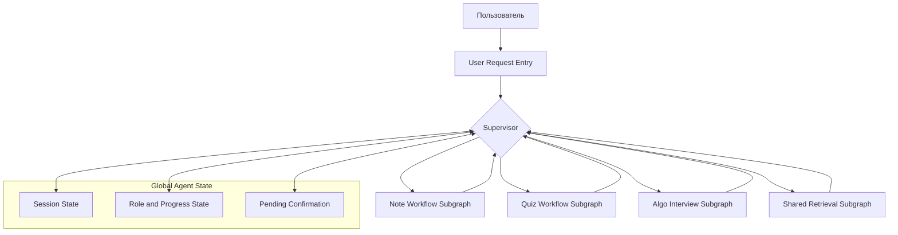
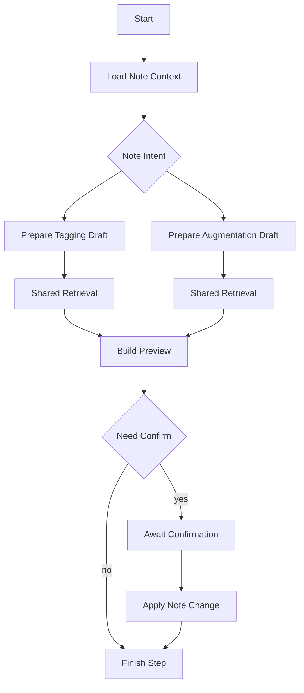
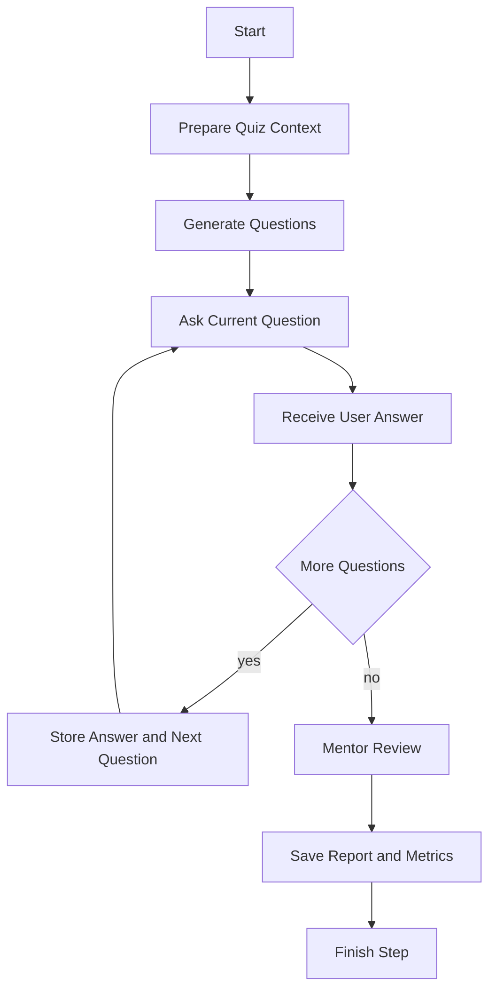
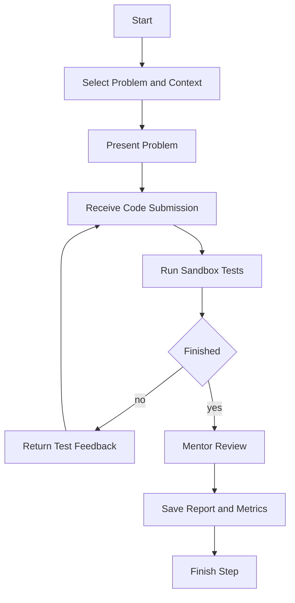
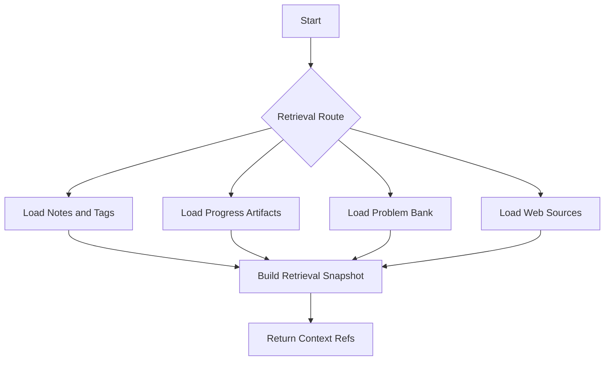
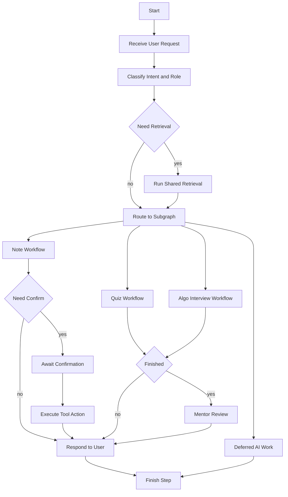

# Архитектура агента

## Overview

Этот документ описывает внутреннюю архитектуру агента внутри контейнера [`Agent System`](diagrams/component.md) и дополняет общую системную архитектуру из [`docs/system-design.md`](system-design.md).

Агент строится на базе LangGraph по паттерну `supervisor plus subgraphs`.

Это означает:
- есть верхнеуровневый supervisor graph
- supervisor принимает пользовательский запрос и определяет сценарий
- специализированные ветки поведения оформляются как подграфы
- retrieval и memory используются как общие сервисы, но управление остаётся у supervisor
- завершение шага подграфа возвращает управление обратно supervisor или завершает пользовательский шаг

## Supervisor graph

Supervisor graph — верхнеуровневый граф, который управляет маршрутизацией запросов, role handoff, запуском подграфов и возвратом результата.

Supervisor отвечает за:
- определение сценария выполнения
- выбор активной роли агента
- подготовку handoff в нужный подграф
- контроль stop conditions
- возврат к пользователю или переход в deferred режим
- координацию confirmation-first шагов

## Role model

В первой версии PoC фиксируются три роли агента.

| Роль | Назначение | Ограничения | Типичные сценарии |
|---|---|---|---|
| `assistant` | Помощь с заметками, тегами, augmentation и общими вопросами | не делает write без preview и confirm | tagging, augmentation, навигация по заметкам |
| `interviewer` | Ведёт квиз или алгоритмическое интервью | не раскрывает готовые ответы и полные решения | quiz flow, algo interview flow |
| `mentor` | Проводит разбор результатов и даёт развивающую обратную связь | работает на основе уже полученных результатов и прогресса | post-quiz review, post-interview discussion |

### Handoff между ролями
- `assistant` → `interviewer` при запуске квиза или интервью
- `interviewer` → `mentor` после завершения сессии или по явному переходу к разбору
- `mentor` → `assistant` после завершения обсуждения результатов

## Scoped state

LangGraph-архитектура агента требует явного разделения состояния по уровням.

| Слой состояния | Назначение | Примеры данных |
|---|---|---|
| Global agent state | Общее состояние графа и сессии | `session_id`, `active_role`, `active_subgraph`, `status` |
| Shared progress state | Долгоживущий прогресс пользователя | слабые темы, история квизов, история интервью |
| Pending confirmation state | Подтверждение risky actions | preview ref, payload hash, confirmation status |
| Subgraph state | Локальное состояние конкретного подграфа | текущий вопрос квиза, текущая задача интервью, note target |
| Artifact refs | Ссылки на долговечные артефакты | report refs, retrieval snapshot refs, deferred job refs |

### Принципы scoped state
- supervisor видит только то состояние, которое нужно для orchestration
- подграф получает только ту часть состояния, которая нужна для его сценария
- возврат из подграфа происходит через нормализованный handoff payload
- состояние подтверждений хранится отдельно от логики диалога
- история прогресса не должна бесконтрольно попадать в каждый prompt

## Subgraphs

В первой версии архитектуры агента фиксируются четыре подграфа.

### 1. Note workflow subgraph

Назначение:
- обработка tagging сценариев
- обработка augmentation сценариев
- управление preview и confirm для изменений заметок

Особенности:
- работает в роли `assistant`
- использует retrieval по заметкам и тегам
- использует `Tool Layer` для чтения и записи в [`Obsidian Vault`](diagrams/context.md)
- все write-операции проходят через confirmation-first policy

### 2. Quiz workflow subgraph

Назначение:
- проведение квиза по выбранным темам или тегам
- управление вопросами, ответами и завершением сессии
- передача результатов в режим разбора

Особенности:
- начинает работу в роли `interviewer`
- при завершении может передать управление в роль `mentor`
- использует retrieval по заметкам и прогрессу
- сохраняет отчёты и численные результаты

### 3. Algo interview subgraph

Назначение:
- проведение алгоритмического интервью
- управление задачей, попытками решения и проверкой через sandbox
- передача результатов в режим разбора

Особенности:
- работает в роли `interviewer`
- вызывает [`Algo Sandbox`](diagrams/container.md)
- использует retrieval по fixed problem bank и прогрессу
- после завершения может передавать управление роли `mentor`

### 4. Shared retrieval subgraph

Назначение:
- единая точка подготовки поискового и справочного контекста
- выбор нужного retrieval path в зависимости от сценария
- возврат нормализованного retrieval snapshot

Особенности:
- используется supervisor и сценарными подграфами
- не принимает продуктовые решения
- возвращает подготовленные ссылки на контекст, а не финальный пользовательский ответ

## State graph

Ниже показан верхнеуровневый граф состояний выполнения агента.

Этот граф показывает:
- вход пользовательского запроса
- классификацию намерения и роли
- условный запуск retrieval
- выбор подграфа
- ветку confirmation для note workflows
- ветку mentor review после завершения quiz или algo flow
- ветку deferred AI work при невозможности завершить шаг синхронно

## Open questions

| ID | Вопрос |
|---|---|
| AQ-001 | Насколько supervisor должен быть rule-based, а насколько LLM-driven |
| AQ-002 | Нужно ли уже в первой реализации выделять отдельный mentor subgraph, или достаточно role handoff внутри quiz and algo flows |
| AQ-003 | Где проходит точная граница между subgraph state и persistent session state |
| AQ-004 | Нужен ли единый internal handoff contract для всех подграфов |
| AQ-005 | Нужно ли выделять shared retrieval как самостоятельный LangGraph subgraph или достаточно отдельного orchestration path |

## Примечания
- документ описывает архитектуру агента как отдельный слой поверх [`docs/system-design.md`](system-design.md) и [`docs/diagrams/component.md`](diagrams/component.md)
- диаграмма [`docs/diagrams/component.md`](diagrams/component.md) показывает структуру контейнера `Agent System`
- граф состояний и подграфы в этом документе показывают логику работы агента на уровне LangGraph
