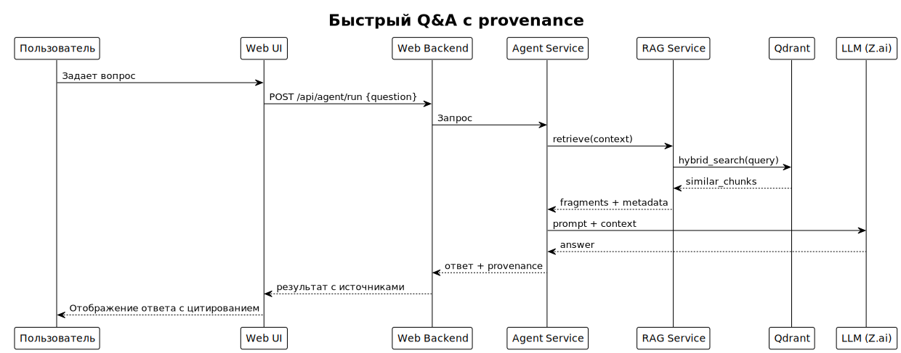
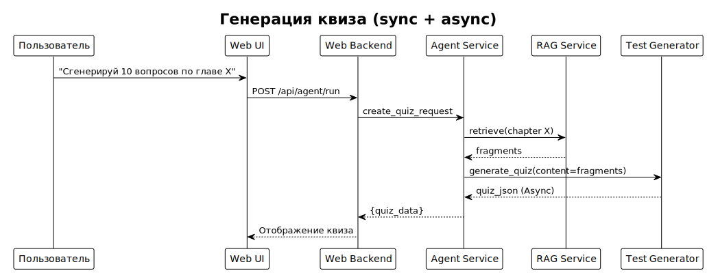

# Архитектура & Design

**Проект:** Lifelong Learning Assistant for Deep Learning  
**Цель:** зафиксировать ключевые архитектурные концепты, потоки данных, решения по масштабированию и интеграции компонентов.

## 📋 Содержание

1. [Ключевые архитектурные принципы](#1-ключевые-архитектурные-принципы)
2. [Sequence diagrams - типовые сценарии](#2-sequence-diagrams---типовые-сценарии)
3. [Ссылки на карточки компонентов](#3-ссылки-на-карточки-компонентов)
4. Идеи от LLM на будущее
   - [Масштабирование и отказоустойчивость](#4-масштабирование-и-отказоустойчивость)
   - [Точки расширения](#5-точки-расширения)
   - [API контракты](#6-api-контракты)
   - [Observability и мониторинг](#7-observability-и-мониторинг)
   - [Безопасность и политика данных](#8-безопасность-и-политика-данных)


---

## 1. Ключевые архитектурные принципы

> **Важно:** Данный документ дополняет [`index.md`](index.md) архитектурными деталями и техническими решениями.

### Ключевые концепции

Система построена на принципах **модульности** и **расширяемости**:
- Каждый компонент имеет четко определенную ответственность
- Компоненты взаимодействуют через стандартизированные интерфейсы
- Новый функционал добавляется через плагинную архитектуру

### 1.1 Основные принципы

| Принцип | Описание | Применение |
|---------|----------|------------|
| **Единая точка входа** | Пользователь взаимодействует через Web UI (React + FastAPI) | Упрощение UX |
| **Модульность через контракты** | Компоненты интегрируются через четкие API-контракты | Заменяемость компонентов, независимая разработка |
| **Разделение ответственности** | Agent Service (Orchestrator)<br> RAG Service (Qdrant + Redis)<br> Test Generator<br> Web UI | специализация компонентов, легкое расширение |
| **Гибридный поиск** | Комбинация векторного (Qdrant) и семантического поиска | Точность и понимание контекста |

### 1.2 Принципы расширяемости

- **Плагинная архитектура Orchestrator** — инструменты добавляются как `run(context)` модули
- **Легкое переключение LLM** — адаптер позволяет переключаться между локальными и облачными моделями
- **Конфигурируемое хранение** — использование Qdrant для векторов и Redis для кэширования

---

## 2. Sequence diagrams - типовые сценарии

### 2.1 Быстрый Q&A с provenance



*Диаграмма последовательности: Быстрый Q&A с provenance*

### 2.2 Генерация квиза (sync + async)



*Диаграмма последовательности: Генерация квиза (sync + async)*

---

## 3. Ссылки на карточки компонентов

Для детального изучения компонентов системы обращайтесь к специализированной документации ([ссылка](./components/index.md)).

### 3.1 Диаграммы и схемы

| Диаграмма | Формат | Файл | Назначение |
|-----------|--------|------|------------|
| **System Components** | PlantUML | [`diagrams/architecture/system-components.puml`](diagrams/architecture/system-components.puml) | 📋 Планируется |
| **Quick Q&A Flow** | Mermaid | [`diagrams/architecture/quick-qa-sequence.mmd`](diagrams/architecture/quick-qa-sequence.mmd) | 📋 Планируется |

---

## 4. Масштабирование и отказоустойчивость

### 4.1 Стратегии масштабирования

| Компонент | Стратегия | Ограничения | SLA Target |
|-----------|-----------|-------------|------------|
| **API Gateway** | Горизонтальное (load balancer) | Stateless архитектура | p99 ≤ 100ms |
| **Orchestrator** | Stateless → горизонтальное | LLM latency зависимость | p99 ≤ 500ms + LLM |
| **LLM Service** | Очередь запросов + rate limiting | Локальные модели: GPU/CPU | p99 ≤ 2s (локальная) |
| **Vector DB** | Qdrant | Объем векторов и RAM | p99 ≤ 100ms |
| **Workers** | Динамическое по queue depth | Время задач vs SLA | 95% задач ≤ 10 мин |

### 4.2 Отказоустойчивость

#### Graceful degradation
- **LLM недоступен** → fallback к упрощенному поиску без генерации
- **Vector DB недоступен** → только полнотекстовый поиск

#### Circuit breakers
- **LLM сервисы**: 3 таймаута → переключение на резервную модель
- **Внешние БД**: connection timeout → повтор с exponential backoff

---

## 5. Точки расширения

### 5.1 Добавление нового источника данных

(написать)

### 5.2 Добавление функционального модуля

(написать)

### 5.3 Добавление новой LLM модели

(написать)

## 6. API контракты

### 6.1 Agent Service

```http
# Запуск агента
POST /api/agent/run
Content-Type: application/json

{
  "question": "Что такое attention mechanism?",
  "session_id": "uuid-123"
}

Response 200:
{
  "answer": "Attention mechanism - это...",
  "session_id": "uuid-123",
  "status": "success"
}
```

### 6.2 RAG Service

```http
# Поиск документов
POST /search
Content-Type: application/json

{
  "query": "Что такое attention mechanism?",
  "top_k": 5
}

Response 200:
{
  "documents": [...]
}
```

### 6.3 Test Generator

```http
# Генерация квиза
POST /api/generate
Content-Type: application/json

{
  "markdown_content": "Текст учебника...",
  "config": {"total_questions": 5}
}
```

---

## 7. Observability и мониторинг

### 7.1 Ключевые метрики

#### API метрики
- **Latency**: p50, p95, p99 для каждого эндпоинта
- **Error rate**: 4xx, 5xx ошибки по типам
- **Throughput**: запросы в секунду

#### LLM метрики
- **Token usage**: токены в минуту/час
- **Response time**: время ответа модели
- **Success rate**: процент успешных запросов

### 7.2 Логирование

#### Структура лога
```json
{
  "timestamp": "2025-11-02T15:36:21.439Z",
  "level": "INFO",
  "component": "agent_service",
  "event": "tool_call",
  "session_id": "uuid-123",
  "tool": "rag_search",
  "duration_ms": 850
}
```

---

## 8. Безопасность и политика данных

### 8.1 Принципы безопасности

- **Локальное хранение по умолчанию**: данные не покидают систему
- **Минимальные привилегии**: доступ только к необходимым ресурсам

---

*Документ обновлен: 2025-11-02*  
*Версия: 2.0*  
*Статус: Готов к использованию*
