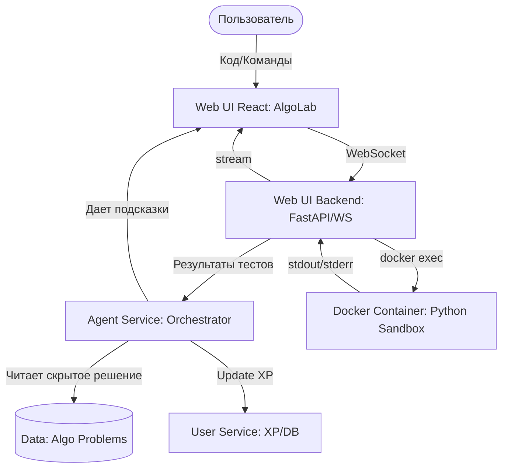

# AlgoLab: Архитектура Интерактивной Песочницы

AlgoLab — это модуль системы, предоставляющий пользователю среду для решения алгоритмических задач на Python с проверкой тестами в реальном времени и начислением опыта (XP).

## Общая схема взаимодействия

## Компоненты системы

### 1. Хранилище задач (`/data/algo_problems`)
Каждая задача хранится в отдельной директории со следующей структурой:
- `task.md`: Описание задачи для пользователя.
- `solution_template.py`: Начальный код (заготовка) для пользователя.
- `tests.py`: Набор тестов (pytest).
- `interviewer_note.md`: Скрытая информация для Агента (подсказки, разбор оптимального решения).

### 2. Песочница (Docker Sandbox)
Изолированный контейнер с Python, работающий в фоновом режиме.
- **Инструментарий**: `uv` для управления зависимостями, `pytest` для тестов.
- **Изоляция**: Ограничение по CPU, памяти и доступу к сети.
- **Выполнение**: Команды пользователя (например, `python main.py`) выполняются через `docker exec`, что обеспечивает мгновенный отклик без пересоздания контейнера.

### 3. Терминал и WebSocket
Реализация реального терминального вывода:
- Фронтенд использует `xterm.js` для отображения.
- Бэкенд проксирует потоки `stdout/stderr` из Docker через WebSocket соединение.

### 4. Система XP (Опыт)
Логика начисления баллов:
- **За тест**: +10 XP за каждый успешно пройденный тест в задаче.
- **За задачу**: +200 XP за полное решение (все тесты пройдены).
- Данные сохраняются в `user_service` в профиле пользователя.

### 5. Роль Агента (Интервьюер)
Агент выступает в роли интервьюера:
- Имеет доступ к `interviewer_note.md`.
- Анализирует код пользователя и дает советы, не раскрывая готового решения.
- Может объяснить ошибки, возникающие в терминале.

## Безопасность
- Контейнеры запускаются от не-root пользователя.
- Монтирование только необходимых файлов задачи.
- Таймауты на выполнение команд (предотвращение бесконечных циклов).