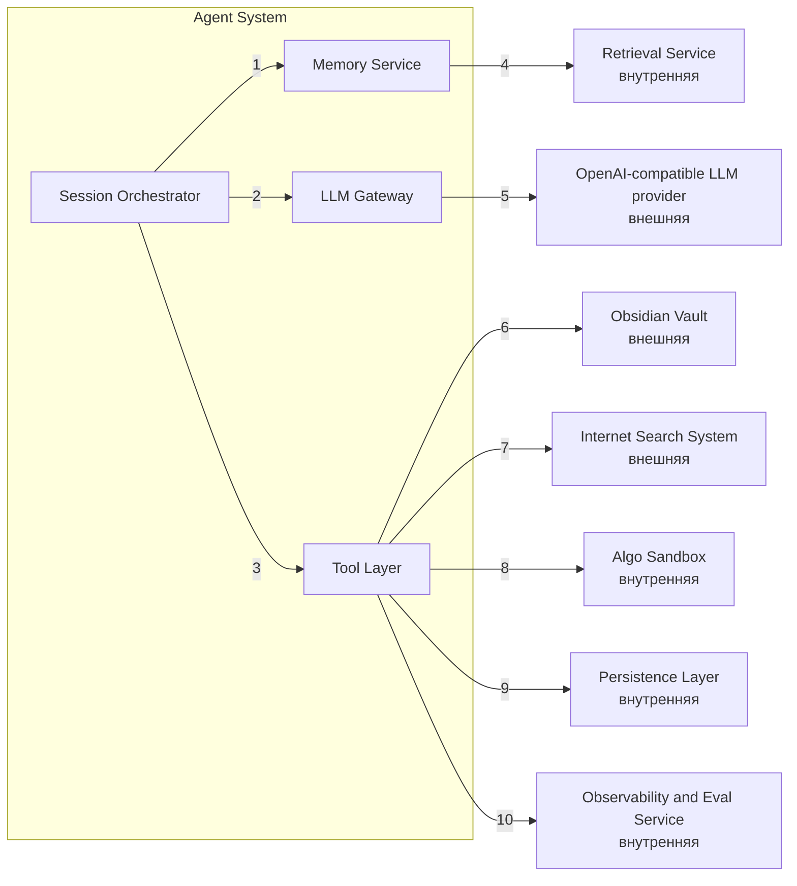

# Диаграмма C4 Component для Agent System

## Сущности на диаграмме

| Сущность | Тип | Относительно Learning AI Assistant | Описание |
|---|---|---|---|
| Session Orchestrator | Component | Внутренняя | Центральный компонент внутри `Agent System`, координирующий выполнение агентного сценария |
| LLM Gateway | Component | Внутренняя | Внутренний компонент `Agent System`, который изолирует работу с `OpenAI-compatible LLM provider` и унифицирует вызовы моделей |
| Tool Layer | Component | Внутренняя | Внутренний компонент `Agent System`, который выполняет детерминированные действия и интеграции |
| [`Memory Service`](../specs/memory-context.md) | Component | Внутренняя | Внутренний компонент `Agent System`, управляющий session state, progress memory и context bundle |
| [`Retrieval Service`](../specs/retriever.md) | Container | Внутренняя | Отдельный контейнер разрабатываемого PoC, поставляющий найденный контекст и retrieval snapshot |
| [`Algo Sandbox`](container.md) | Container | Внутренняя | Отдельный контейнер разрабатываемого PoC для изолированного выполнения пользовательского кода и тестов |
| [`Persistence Layer`](container.md) | Container | Внутренняя | Отдельный контейнер разрабатываемого PoC для хранения отчётов, метрик, индекса, metadata и deferred jobs |
| [`Observability and Eval Service`](../specs/observability-evals.md) | Container | Внутренняя | Отдельный контейнер разрабатываемого PoC для телеметрии, quality control и eval-сигналов |
| OpenAI-compatible LLM provider | External System | Внешняя | Внешний провайдер LLM, а не внутренний модуль системы. Примеры: OpenAI, ai-mediator, Ollama |
| Obsidian Vault | External System | Внешняя | Внешнее пользовательское хранилище заметок и тегов |
| Internet Search System | External System | Внешняя | Внешний провайдер интернет-поиска, а не MCP tool внутри системы. Примеры: Tavily, Brave Search, Bright Data |

## Описание взаимодействий на диаграмме

| № | Откуда | Куда | Смысл взаимодействия |
|---|---|---|---|
| 1 | Session Orchestrator | Memory Service | Читает и обновляет состояние сессии, память прогресса и context bundle |
| 2 | Session Orchestrator | LLM Gateway | Передаёт запросы на взаимодействие с LLM |
| 3 | Session Orchestrator | Tool Layer | Передаёт команды на детерминированные действия и side effects |
| 4 | Memory Service | Retrieval Service | Получает retrieval snapshot и ссылки на найденный контекст |
| 5 | LLM Gateway | OpenAI-compatible LLM provider | Отправляет запросы к моделям и получает ответы |
| 6 | Tool Layer | Obsidian Vault | Читает заметки и записывает подтверждённые изменения |
| 7 | Tool Layer | Internet Search System | Отправляет поисковые запросы и получает найденные источники |
| 8 | Tool Layer | Algo Sandbox | Передаёт код пользователя и запускает тесты задач |
| 9 | Tool Layer | Persistence Layer | Сохраняет отчёты, metadata и другие артефакты выполнения |
| 10 | Tool Layer | Observability and Eval Service | Передаёт telemetry, safety сигналы и quality события |

## Примечания
- диаграмма показывает структуру контейнера `Agent System`, а не граф выполнения агента.
- граф состояний и переходов агента и workflow будут показаны отдельной диаграммой.
