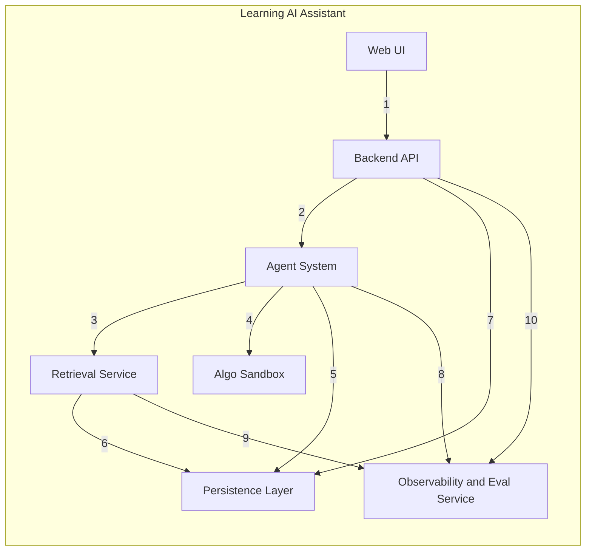
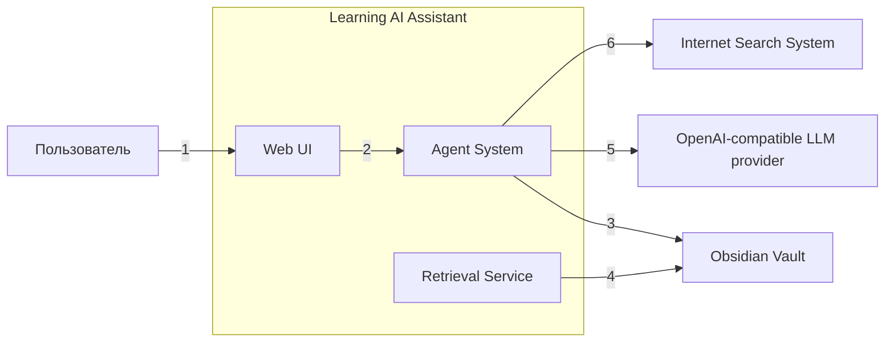
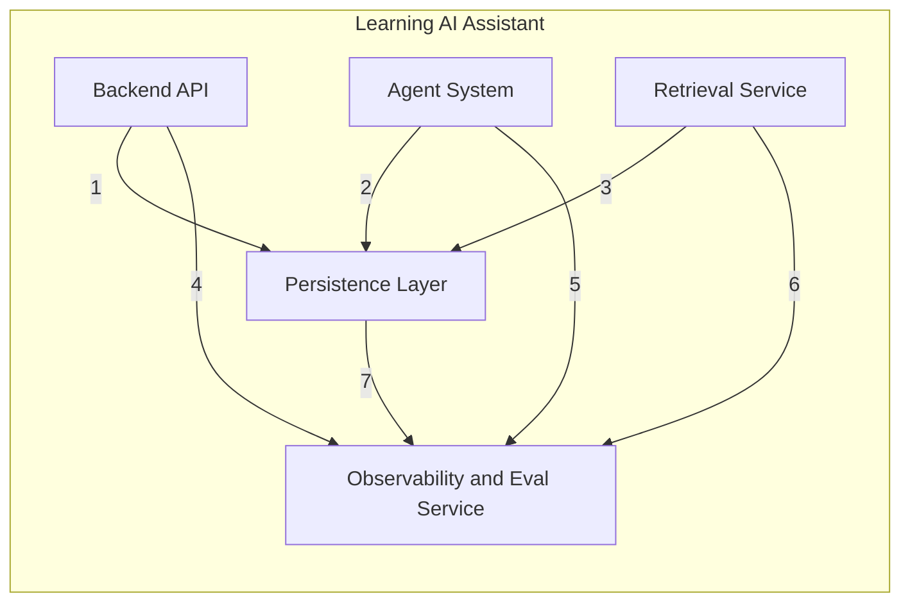

# Диаграммы C4 Container

Ниже контейнерный уровень представлен не одной перегруженной схемой, а набором из трёх связанных диаграмм.

## Диаграмма 1. Внутренние контейнеры системы

## Сущности на диаграмме 1

| Сущность | Тип | Описание |
|---|---|---|
| Web UI | Container | Пользовательский интерфейс для чата, preview, квизов и интервью |
| Backend API | Container | Точка входа от интерфейса, валидация запросов и передача управления дальше |
| Agent System | Container | Агентная логика, внутри которой объединены `Session Orchestrator`, `LLM Gateway`, `Tool Layer` и [`Memory Service`](docs/specs/memory-context.md) |
| Retrieval Service | Container | Поиск и подготовка контекста по заметкам, тегам, отчётам см. [`docs/specs/retriever.md`](docs/specs/retriever.md) |
| Algo Sandbox | Container | Внутренний контейнер системы для изолированного выполнения пользовательского кода и тестов |
| Persistence Layer | Container | Хранение отчётов, метрик, индекса, metadata и deferred jobs |
| Observability and Eval Service | Container | Внутренний сервис наблюдаемости и контроля качества. Для PoC целевая реализация — Langfuse |

## Описание взаимодействий на диаграмме 1

| № | Откуда | Куда | Смысл взаимодействия |
|---|---|---|---|
| 1 | Web UI | Backend API | Передаёт пользовательские действия и запросы интерфейса |
| 2 | Backend API | Agent System | Передаёт управление в агентный контур |
| 3 | Agent System | Retrieval Service | Запрашивает поиск и подготовку контекста |
| 4 | Agent System | Algo Sandbox | Отправляет код пользователя и запускает тесты задач |
| 5 | Agent System | Persistence Layer | Сохраняет отчёты, состояния, metadata и отложенные задания |
| 6 | Retrieval Service | Persistence Layer | Сохраняет индекс, snapshot refs и retrieval metadata |
| 7 | Backend API | Persistence Layer | Читает или обновляет прикладные данные, нужные для работы интерфейса и сессий |
| 8 | Agent System | Observability and Eval Service | Передаёт трейсы, события выполнения, safety сигналы и quality telemetry |
| 9 | Retrieval Service | Observability and Eval Service | Передаёт метрики поиска, размер snapshot и сигналы качества retrieval |
| 10 | Backend API | Observability and Eval Service | Передаёт технические логи запросов и метрики API |

## Диаграмма 2. Взаимодействие контейнеров с внешними системами

## Сущности на диаграмме 2

| Сущность | Тип | Описание |
|---|---|---|
| Пользователь | Actor | Внешний актор, который работает с системой через интерфейс |
| Web UI | Container | Внутренний контейнер системы, через который пользователь запускает сценарии и получает результат |
| Agent System | Container | Внутренний контейнер агентной логики, который работает с внешними сервисами и пользовательскими артефактами |
| Retrieval Service | Container | Внутренний контейнер, который читает заметки и метаданные для поиска и индексации |
| Obsidian Vault | External System | Внешнее пользовательское хранилище заметок и тегов |
| OpenAI-compatible LLM provider | External System | Внешний провайдер LLM, а не внутренний модуль системы. Примеры: OpenAI, ai-mediator, Ollama |
| Internet Search System | External System | Внешний провайдер интернет-поиска, а не MCP tool внутри системы. Примеры: Tavily, Brave Search, Bright Data |

## Описание взаимодействий на диаграмме 2

| № | Откуда | Куда | Смысл взаимодействия |
|---|---|---|---|
| 1 | Пользователь | Web UI | Отправляет команды и управляет сценариями системы |
| 2 | Web UI | Agent System | Передаёт действия пользователя в агентный контур |
| 3 | Agent System | Obsidian Vault | Читает заметки и записывает подтверждённые изменения |
| 4 | Retrieval Service | Obsidian Vault | Читает заметки, теги и метаданные для индексации и retrieval |
| 5 | Agent System | OpenAI-compatible LLM provider | Отправляет контекст и запросы на генерацию и получает ответы от LLM |
| 6 | Agent System | Internet Search System | Отправляет поисковые запросы и получает найденные источники и фрагменты |

## Диаграмма 3. Хранение и observability

## Сущности на диаграмме 3

| Сущность | Тип | Описание |
|---|---|---|
| Backend API | Container | Точка входа от интерфейса, которая читает и обновляет прикладные данные и публикует технические события |
| Agent System | Container | Основной контейнер агентной логики, который сохраняет артефакты сценариев и отправляет telemetry |
| Retrieval Service | Container | Контейнер поиска и индексации, который сохраняет retrieval metadata и публикует quality сигналы |
| Persistence Layer | Container | Хранение отчётов, метрик, индекса, metadata и deferred jobs |
| Observability and Eval Service | Container | Внутренний сервис наблюдаемости и контроля качества. Для PoC целевая реализация — Langfuse |

## Описание взаимодействий на диаграмме 3

| № | Откуда | Куда | Смысл взаимодействия |
|---|---|---|---|
| 1 | Backend API | Persistence Layer | Читает и обновляет прикладные данные, нужные для интерфейса и сессий |
| 2 | Agent System | Persistence Layer | Сохраняет отчёты, состояния, metadata и отложенные задания |
| 3 | Retrieval Service | Persistence Layer | Сохраняет индекс, snapshot refs и retrieval metadata |
| 4 | Backend API | Observability and Eval Service | Передаёт технические логи запросов и метрики API |
| 5 | Agent System | Observability and Eval Service | Передаёт трейсы, события выполнения, safety сигналы и quality telemetry |
| 6 | Retrieval Service | Observability and Eval Service | Передаёт метрики поиска, размер snapshot и сигналы качества retrieval |
| 7 | Persistence Layer | Observability and Eval Service | Передаёт сигналы о записях, сбоях и состоянии хранения |
