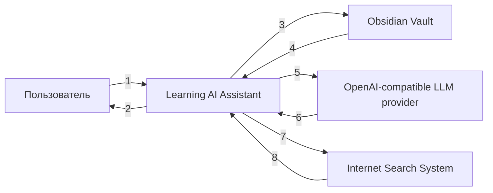

# Диаграмма C4 Context

## Сущности на диаграмме

| Сущность | Тип | Описание |
|---|---|---|
| Пользователь | Actor | Инициирует сценарии работы с системой и получает результаты |
| Learning AI Assistant | System | Центральная проектируемая PoC-система, описанная в [`docs/system-design.md`](docs/system-design.md) |
| Obsidian Vault | External System | Источник заметок, тегов и место применения подтверждённых изменений |
| OpenAI-compatible LLM provider | External System | Внешний провайдер LLM, а не внутренний модуль системы. Примеры: OpenAI, ai-mediator, Ollama |
| Internet Search System | External System | Внешний провайдер интернет-поиска, а не MCP tool внутри системы. Примеры: Tavily, Brave Search, Bright Data |

## Описание взаимодействий на диаграмме

| № | Откуда | Куда | Смысл взаимодействия |
|---|---|---|---|
| 1 | Пользователь | Learning AI Assistant | Отправляет запросы на работу с заметками, квизы и интервью |
| 2 | Learning AI Assistant | Пользователь | Возвращает ответы, preview изменений, вопросы и обратную связь |
| 3 | Learning AI Assistant | Obsidian Vault | Читает заметки и записывает подтверждённые изменения |
| 4 | Obsidian Vault | Learning AI Assistant | Возвращает заметки, теги и метаданные |
| 5 | Learning AI Assistant | OpenAI-compatible LLM provider | Отправляет контекст и запросы на генерацию |
| 6 | OpenAI-compatible LLM provider | Learning AI Assistant | Возвращает ответы от LLM |
| 7 | Learning AI Assistant | Internet Search System | Отправляет поисковые запросы |
| 8 | Internet Search System | Learning AI Assistant | Возвращает найденные источники и фрагменты |
