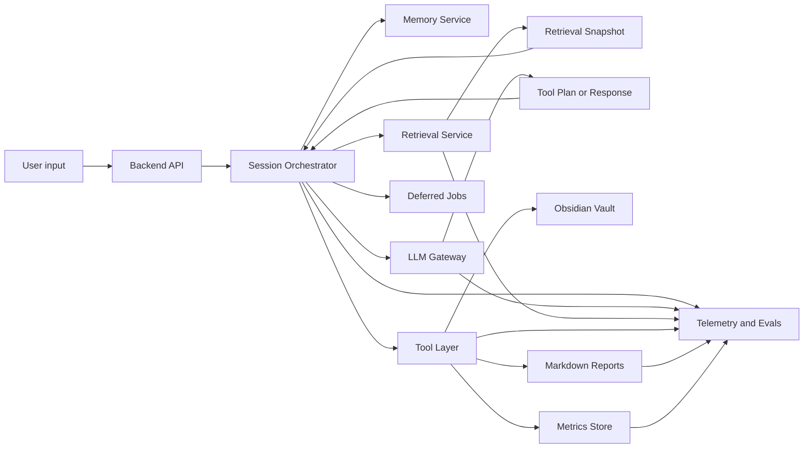

# Диаграмма: Data Flow

Диаграмма показывает движение данных между пользовательским запросом, orchestration-слоем, LLM, инструментами и хранилищами. Логические границы описаны в [`docs/system-design.md`](../system-design.md), а telemetry-контур — в [`docs/specs/observability-evals.md`](../specs/observability-evals.md).

## Что важно
- `Retrieval Snapshot` выступает отдельным артефактом между retrieval и reasoning.
- `Tool Plan or Response` отделяет LLM reasoning от фактического исполнения.
- `Deferred Jobs` позволяют сохранить continuity сценария при сбое внешней LLM.
- Telemetry собирается из всех ключевых слоёв, но не должна хранить лишний пользовательский контент.
