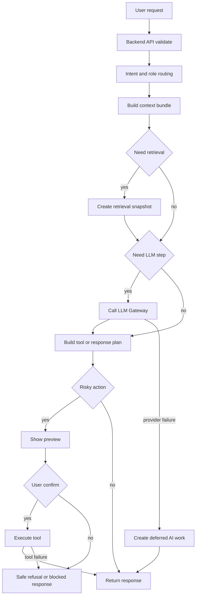

# Диаграмма: Workflow

Диаграмма показывает общий workflow обработки пользовательского запроса с ветвями подтверждения, деградации и ошибок. Детали состояний описаны в [`docs/specs/orchestrator.md`](../specs/orchestrator.md).

## Что важно
- Retrieval и LLM являются условными шагами, а не обязательными для каждого запроса.
- Любой risky action проходит через preview и подтверждение.
- При сбое LLM шаг не обязан завершаться полной ошибкой: возможен deferred режим.
- Ошибки исполнения переводятся в управляемый blocked response, а не в неявное поведение.
