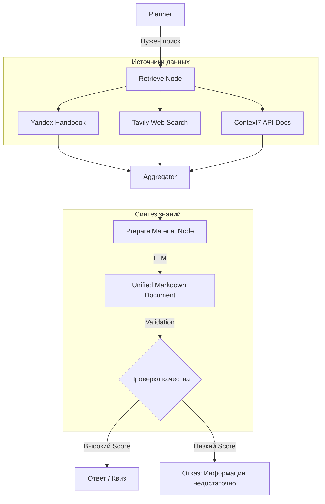

# Концепция: Unified Context Assembly (Multi-Source Retrieval)

## Проблема
Текущая реализация агента опирается только на RAG (учебник Яндекса). Для полноценного помощника необходим доступ к:
1.  **Свежей информации** из интернета (Tavily Search).
2.  **Технической документации** библиотек (Context7).

Простая склейка результатов из разных источников приводит к потере структуры, дубликатам и ошибкам в формулах.

## Решение: Узел Prepare Material (Golden Source)

Мы внедряем архитектуру, где агент выступает в роли "технического редактора".

### 1. Унифицированный формат документов
Все инструменты поиска (Retrievers) возвращают данные в едином формате:
- `content`: текст фрагмента.
- `source`: ссылка или название главы.
- `score`: релевантность.
- `type`: тип источника (handbook, web, docs).

### 2. Архитектурная схема

### Преимущества подхода
- **Единый стандарт**: Генератор квизов всегда получает валидный Markdown.
- **Достоверность**: Мы оцениваем релевантность итогового документа относительно всех чанков.
- **Прозрачность**: В итоговом материале четко разделены теоретические основы (учебник) и практические примеры (документация).