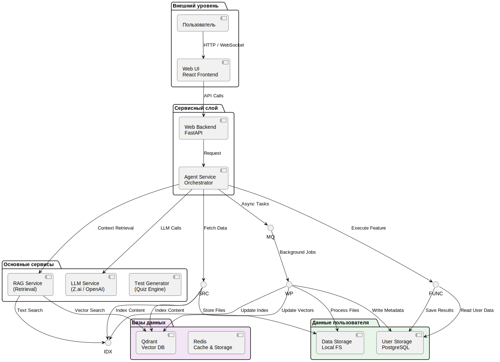

# Обзор системы

## Архитектура Lifelong Learning Assistant

- пользователь взаимодействует через `Web UI`
- все «умные» операции оркеструет `LLM Agent (Orchestrator)`
- данные индексируются в векторной БД и полнотекстовом индексе
- тяжёлые вычисления выполняются асинхронно через очередь и воркеры

## Основные компоненты (сгруппированы)

### Компоненты Orchestration & Core

* **Web UI** — React-фронтенд и FastAPI-бэкенд для взаимодействия с пользователем.
* **Agent Service (Orchestrator)** — основной оркестратор на FastAPI, управляющий сессиями, инструментами и LLM.
* **LLM Service** — модуль интеграции с провайдерами (Z.ai, OpenRouter, OpenAI, Mistral).

### Databases & Retrieval

* **Qdrant** — векторная база данных для семантического поиска.
* **Redis** — кэширование запросов и результатов поиска.

> Qdrant обеспечивает быстрый семантический поиск по эмбеддингам, а Redis используется для оптимизации производительности.

### User Data (Данные пользователя)

* **User Storage (Postgres)** — пользователи, конфигурации, результаты квизов, метаданные карточек, интервалы spaced repetition.
* **Data Storage (MinIO / Local FS)** — сырые файлы: загруженные книги, web-snapshots.

> Эти хранилища содержат всё, что относится к данным пользователя и долговременному хранению.

### Background tasks (Фоновые задачи)

* **Task Queue & Workers** — асинхронная обработка тяжелых задач (генерация тестов, обработка документов).

> Асинхронная подсистема обеспечивает отзывчивость UI при выполнении длительных операций.

### Data Sources

* **Source Module** — Books (fb2/epub), Telegram, Tavily (web), Context7 (docs) и т.п. Адаптеры собирают/фильтруют сырой контент и либо индексируют его, либо отдают Orchestrator для разовой обработки.

### Functional Modules

* **Test Generator** — специализированный сервис для генерации квизов и оценки ответов.
* **RAG Service** — сервис гибридного и семантического поиска по учебным материалам.

## Ключевые потоки данных (упрощённо)

1. **Интерактивный пользовательский запрос**
   UI → API → Orchestrator → (Retriever → FAISS/ES) + (LLM) → ответ пользователю (и/или создание background task).

2. **Добавление/обновление источника (книга, web snapshot)**
   Adapter → Data Storage (FS/MinIO) → MQ → Worker → (Embedding Service → Vector DB) + (Indexing → Elasticsearch) + запись метаданных в Postgres.

3. **Асинхронная обработка**
   Orchestrator ставит задачи в Task Queue; Worker Pool выполняет парсинг, эмбеддинг, индексацию и обновляет хранилища.

## Почему сгруппировали компоненты так

* **Логическая ясность** — группы отражают основные роли: оркестрация, хранение данных для поиска, хранение пользовательских данных, и фоновые обработчики. Это упрощает навигацию в docs и помогает быстро найти ответ на вопрос «где хранится/где обрабатывается X».
* **Понятие владельцев/ответственности** — группы легко привязываются к командам: infra (DB/Storage), ml/search (Retriever/FAISS/ES), backend (API/Orchestrator), ops (MQ/Workers).
* **Проектирование SLAs и масштабирования** — разные группы имеют разные требования (например, FAISS и воркеры — горизонтальное масштабирование; Postgres — stateful и backup-first).

## Где дальше смотреть (ссылки в docs)

* Архитектура & sequence diagrams: `architecture.md`
* Component Cards: `components/index.md`
