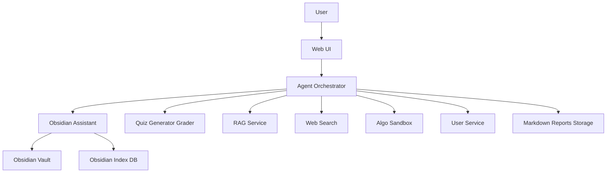
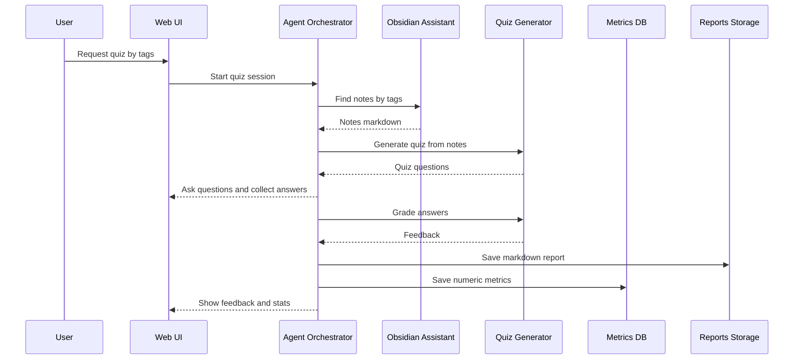
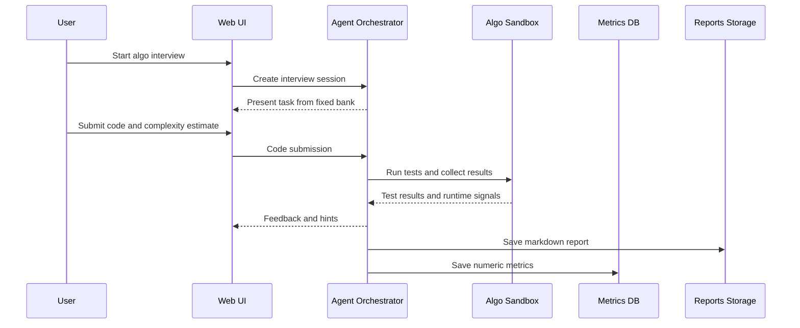

# Product Proposal: learning-ai-assistant

## 1) Обоснование идеи

`learning-ai-assistant` — агентная система, которая связывает личную базу знаний в Obsidian (заметки по алгоритмам), проверку понимания через квизы и практику подготовки к алгоритмическим интервью.

Почему это нужно:
- Obsidian хранит знания, но сам по себе не обеспечивает регулярную проверку понимания и «тренировку».
- Алгоритмическая подготовка требует циклов: теория → практика → обратная связь → фиксация результатов → выбор следующих тем.
- Пользователю нужен единый рабочий процесс, где:
  - заметки индексируются и легко находятся по темам/тегам;
  - из заметок быстро создаются квизы;
  - собеседования проводятся на фиксированном банке задач с тегами;
  - прогресс хранится в удобном для чтения человеком и LLM-формате (Markdown), чтобы обсуждать свой прогресс с ИИ-ассистентами, в том числе и в веб-чатах.

## 2) Цели и метрики успеха

### 2.1 Продуктовые метрики
- Уменьшение времени поиска нужной заметки/темы по сравнению с «ручным» режимом.
- Уменьшение времени проставления тегов для заметки/темы по сравнению с «ручным» режимом.
- Доля сессий, где пользователь проходит квиз до конца.
- Доля сессий, где код пользователя прошел все тесты от задачи до полного решения.

### 2.2 Агентские метрики
- Точность подбора тегов (accept rate предложенных тегов).
- Процент write-операций в vault, выполненных только после подтверждения пользователем.
- Качество квиза (оценка сгенерированого квиза по имеющимся входным данным LLM-судьей).
- Качество обратной связи по квизу (LLM-судья по критериям).
- Процент выдачи правильных ответов пользователю от квиза для всех пройденных пользователем собеседований (должен быть как можно меньше).
- Качество подсказок и ответов на вопросы от интервьювера (оценка LLM-судьей).
- Процент попыток LLM написать решение алго задачи за пользователя от всех алго сессий (как можно меньше)
- Корректность следования типичным wokrflow (успешность прохождения типичных сценариев).

### 2.3 Технические метрики
- Время ответа интерактивного запроса (без учёта внешней LLM латентности): p95.
- Время поиска заметок по тегам.
- Ошибки интеграций (RAG/Quiz/WebSearch/Obsidian API) и корректность обработки ошибок.

## 3) Основные сценарии (PoC-демо)

### 3.1 Tagging заметки
Пользователь просит подобрать теги для заметки. Система:
1) получает контекст существующих тегов;
2) предлагает кандидатов;
3) применяет патч к заметке только после подтверждения.

### 3.2 Note augmentation (web search → дополнение заметки)
Пользователь просит найти внешние материалы и дополнить заметку. Система:
1) делает web search;
2) извлекает релевантные фрагменты;
3) добавляет новую секцию `Sources` (и ссылки) с preview/diff;
4) пишет в vault только после подтверждения.

### 3.3 Quiz по темам (тегам)
Пользователь задаёт список тегов и просит квиз на 5 вопросов. Система:
1) находит релевантные заметки по тегам;
2) формирует материал для генерации квиза;
3) генерирует квиз и проводит его;
4) оценивает ответы и даёт обратную связь;
5) сохраняет результаты:
   - Markdown отчёт (развернутый разбор);
   - метрики в БД (статистика для UI).

### 3.4 Алго-собеседование (фиксированный банк задач)
Пользователь просит собеседование.

Система:
1) выбирает задачу из фиксированного набора по темам/тегам и истории прогресса;
2) запускает docker-песочницу для выполнения кода пользователя;
3) принимает попытки пользователя, запускает тесты;
4) проверяет заявленную сложность (время/память) и даёт обратную связь;
5) сохраняет результаты (Markdown отчёт + метрики в БД).

## 4) Edge cases и обработка ошибок

- Obsidian заметка без YAML frontmatter: система предлагает безопасно добавить frontmatter блок (с подтверждением).
- Дубликаты тегов, различия регистра, «грязные» теги: нормализация в индексе.
- Большой vault: инкрементальная синхронизация и индексирование (не полный парсинг каждый раз).
- Недоступна внешняя LLM: деградация к retrieval-only и пройти алго собеседование по тестам в песочнице без агента.

Все результаты алго собеседования сохраняться, когда LLM-будет доступна можно будет попросить у нее обратную связь.

- Недоступен web search: система предпредит об этом и продолжает работу по локальным заметкам.
- Prompt injection из заметок или web-страниц: контент считается недоверенным, действия на запись требуют подтверждения.

1. Агент обладает инстурментами, только на запись текста в маркдаун файлы.
2. Агент может писать свои текстовые ответы только в окна приложения.
3. Агент не имеет доступ к выполнению команд в терминале.

Кажется, что архитектурно агент имеет только риск выдачи правильных ответов пользователя по время собеседования.

## 5) Ограничения и предположения

- Vault предполагается под git, поэтому rollback возможен. Изменения заметок запрещены без подтверждения.
- Теги в заметках считаются источником истины только из YAML frontmatter (inline теги в тексте не используются для индекса/рефакторинга).
- Стек управляется через HSM (HSM-first), компоненты разворачиваются модульно.

## 6) Архитектурный набросок

### 6.1 Компоненты



### 6.2 Data flow: Quiz по тегам



### 6.3 Data flow: Алго-собеседование



## 7) Что делегируем LLM, а что нет

| Область | LLM | Детерминированно | Причина |
|---|---|---|---|
| Подбор тегов | предложить кандидатов | финальное применение патча, нормализация, индекс | безопасность и консистентность |
| Дополнение заметки | суммаризация, формирование секции | извлечение ссылок, формат патча, diff, запись | контроль изменений |
| Генерация квиза | генерация вопросов | схема/валидация, дедупликация, сохранение | качество и воспроизводимость |
| Алго-интервью | подсказки и фидбек | запуск тестов, сбор метрик, ограничения песочницы | безопасность и объективность |

## 8) HSM-first: как управляем стеком

HSM — источник истины состава стека. Принцип:
1) меняем манифест (intent);
2) материализуем через `hsm sync`.

Команды, которые фиксируем как базовые:
```bash
hsm init
hsm list
hsm check
hsm sync
```

## 9) Out-of-scope (для PoC)

- не гарантирует полноту и идеальную корректность автодополнений заметок (это PoC);

Только предложения для пользователя, принимать их, редактировать или отменить, - выбор пользоватля.
Со стороны приложения - только помощь.

- не содержит курса по алгоритмам.

Сервис помогает систематизировать имеющиеся заметки и тренероваься на фиксированом банке задач с LeetCode.
Поиск материала, подготовка заметок по найденым курсам, пополнение банка алго задача, - это на пользователе.

- не делает содержит механизмом планирования индивидуальной траектории развития ит специалиста.
